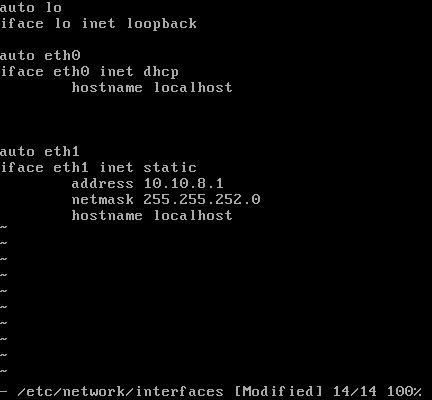

# Zadanie 1

Organizacja planuje ulepszyć działanie istniejącej sieci biurowej.

1. Zaprojektuj oraz udokumentuj konfigurację prototypu rozwiązania z wykorzystaniem oprogramowania ``VirtualBox`` lub podobnego. 

## Schemat

## Wymagania

W sieci pracują komputery biurowe oraz urządzenia siecowe współdzielące zasoby. Do tej pory organizacja borykała się z ręczna konfiguracją urządzeń oraz adresami IP które dla ludzi z poza kadry technicznej były niezrozumiałe. Postanowiono:

* Wykorzystać usługę DHCP do nadawania adresów w sposób automatyczny dla wszystkich stacji roboczych
* Serwer oraz durządzenia IP tj: drukarka muszą posiadać stałe adresy celem zminimalizowanai potrzeby rekonfiguracji ustawiań klientów
* Wprowadzić translację pomiędzy Adresami IP oraz nazwami domenowymi dla kluczowych zasobów
   - erp.mojaorganizacja.pl
   - drukarka.mojaorganizacja.pl
   - router.mojaorganizacja.pl
* Wszystkie urządzenia łączą się z siecią internet z wykorzystaniem bramy NAT
* Wykorzystać podsieć rozmiaru /22 pozwalającej zaadresować co najmniej 600 urządzeń

## Zawartość dokumentacji

 * Charakterystyka rozwiazania 
 * Adresy sieci IP
 * Oprogramowanie wykorzystane do realizacji poszczególnych wymagań
 * Kluczowa konfiguracja oprogramowania pozwalająca na odtworzenie stanu po reinstalacji środowiska
    1. Konfiguracja NAT z iptables 
    2. Konfiguracja DHCP
    3. Konfiguracja DNS
    4. Konfiguracja interfejsów sieciowych
    5. Inne jeżeli wykorzystane
    
SIEĆ: 10.10.8.0/22
MASKA: 255.255.252.0

I.	PC-ROUTER-NAT:
A.	PODSTAWOWA-KONFIGURACJA-PC-ROUTER-NAT

Wrzucamy 2 karty sieciowe.
Karta eth0 podłaczona do sieci NAT oraz kartę eth1 podłączoną do sieci SIEĆNAT-lan1.
Konfigurujemy dwa interfejsy sieciowe w pliku /etc/network/interfaces. ETH0-dynamicznie, ETH1-statycznie z adresem 10.10.8.1 z początku naszej sieci zgodnie z konwencją oraz maską 255.255.252.0. 
Komendą „rc-service networking restart” restartujemy ustawienia naszych kart sieciowych. 
Od tej chwili nasze karty sieciowe na PC-ROUTER-NAT są skonfigurowane. Możemy to podejrzeć komendą „ip a”. 

B.	DHCP-PC-ROUTER-NAT
W kolejnym kroku na naszym PC-ROUTER-NAT instalujemy usługę dhcp oraz dodajemy go do autostartu naszej maszyny. Unikniemy w ten sposób konieczności ręcznego uruchamiania usługi dhcp po restarcie/awarii maszyny – „apk add dhcp”, „rc-update add dhcpd”. 
Kolejnym krokiem jest skonfigurowanie usługi dhcp w katalogu /etc/dhcp/dhcpd.conf.
Ustawiamy odpowiednią sieć, w naszym przypadku 10.10.8.0 maskę 255.255.252.0. Range mówi nam w jakim zakresie nasza maszyna ma przydzielać adresy IP. Ustawiamy również option router. Jest to nic innego jak nasza brama-adres ip routera, przez którą inne urządzenia będą się łączyć z siecią rozległą (będą miały dostęp do internetu). W naszym jest to 10.10.8.1. Option domain-same-server (DNS) – na razie wrzućmy googlowskie 8.8.8.8 oraz 8.8.4.4.  
Zapisujemy ustawienia i restartujemy usługę „rc-serveice dhcpd restart”.
Od tego momentu nasz PC-ROUTER-NAT, każdemu nowemu urządzeniu będzie przydzielał adresy ip z zakresu 10.10.9.1-10.10.11.254, gateway-em 10.10.8.1 oraz dns’ami 8.8.8.8 oraz 8.8.4.4 w seici 10.10.8.0/22.

C.	NAT-PC-ROUTER-NAT
W Piewszym kroku uruchamiamy przekazywanie pakietów. Możemy to zrobić komendą „sysctl net.ipv4.ip_forward=1”. Następnie dodajemy odpowiedni wpis, aby po restarcie/awarii naszego PC-ROUTER-NAT zachowały się wszystkie nasze konfiguracje.  Zrobimy to poleceniem „echo „sysctl net.ipv4.ip_forward=1” > /etc/syscel.d/01—network.conf”.Od tego momentu po restarcie przekerowanie pakietów włączy się automatycznie.
W kolejnym kroku uruchomimy translacje adresów – NAT, czyli ukrywanie prywatnego adresu IP. Zmiana prywatnego w publiczny, którym się posugujemy w sieci. Jest nam to potrzebne, aby urządzenia które zostaną skonfigurowane w zadany sposób mogły się połączyć z internetem. 
Modyfikacja tablicy NAT-u.
Potrzeby nam jest do tego program „iptables”. Instalujemy go na naszej maszynie komendą „apk add iptables’.
IPTABLES w swoich „funkcjach” ma obsługę natu. 
W naszej maszynie wpisujemy „iptables –t nat –A POSTROUTING –o eth0 –j MASQUERADE”. Oznacza to – iptables (wywołujemy program iptables) –t (target/cel jakiej tablicy dotyczy modyfkacja - w naszym przypadku nat) nat –A (APPEND/DODAJ WPIS do POSTROUTING – CZYLI MODYFIKACJA PAKIETU PO ODEBRANIU PAKIETU) –output (wszystko co wychodzi na eth0 będą poddane operacji) eth0 –j MASQUERADE (maskowanie adresu prywatnego pod adres publiczny).
Ostatnim krokiem jest zapisanie tego wpisu na stałe programie iptables oraz dodanie programu do autostartu systemu. Zrobimy to komendą „/etc/init.d/iptables save” oraz  „rc-update add iptables”. 
Od tego momentu po starcie naszego PC-ROUTER-NAT wczyta się automatycznie program iptables z dokonanym wpisem o translacji prywatnych adresów ip na publiczne adresy ip.

D.	DNS-PC-ROUTER-NAT
Ostatnią rzeczą, która nam została do skonfigurowania na naszym PC-ROUTER-NAT jest DNS.
W pierwszym kroku instalujemy program DNSMASQ – „apk add dnsmasq” oraz wrzucamy do autostartu „rc-update add dnsmasq”.: 
W kolejnym kroku edytujemy plik hosts w katalogu /etc/hosts. Chcemy, aby kluczowe zasoby 
Erp.mojaorganizacja.pl rozwiązał się na adresie 10.10.8.51
Drukarka.mojaorganizacja.pl na 10.10.8.50
Router.mojaorganizacja.pl na 10.10.8.1
Jak już wiemy adres 10.10.8.1 jest to adres naszego routera. Pozostałe dwa adresy to adresy, które zostały przypisane statycznie do serwera 10.10.8.51 i drukarki 10.10.8.50 w naszej firmie. 

Wróćmy teraz do naszych DNS-ów. Edytujemy więc nasz plik dhcpd.conf w katalogu /etc/dhcp/dhcpd.conf i dokonujemy odpowieniego wpisu w „option domain-name-server”. Po takiej niewielkiej zaminie komunikacja z tymi zasobami zawsze rozwiąże się na ustalonym adresie IP z pliku hosts, gdzie w pierwszej kolejności zagląda system po próbie komunikacji. 

II.	POZOSTAŁE URZĄDZENIA (serwer/drukarka-static, inne urządzenia-dhcp)
Teraz pora na konfiguracje naszych urządzeń w biurze. Serwer oraz drukarka mają posiadać stałe IP celem zminimalizowania potrzeby rekonfiguracji ustawień klientów. Tak więc na serwerze i drukarce edytujemy interfejs karty sieciowej eth0 na statyczny z odpowiednim adresem, który ustaliliśmy wcześniej SERWER-10.10.8.51, DRUKARKA 10.10.8.50. Ustawiamy brame na 10.10.8.1, czyli nasz PC-ROUTER-NAT, co nam pozwoli na połączenie z siecią. Edytujemy również plik z DNS-ami /etc/resolv.com i wpsujemy ręcznie „nameserver 10.10.8.1” 

 
Tak samo robimy na drukarce: 

 
Możemy przejrzeć ustwienia komendą „ip a”, „ip route show” oraz podejrzeć dns-y „cat /etc/resolv.conf”. 

 
Pozostałe urządzenia mają dynamiczną konfigurację tak jak ustaliliśmy na routerze z zakresu 10.10.9.1-10.10.11.254. Wystarczy na tych urządzeniach ustawić interface sieciowy na dhcp. 
Każde nowe urządenie w firmie po protokole dhcp uzyska pełną konfigurację sieci zgodnie z naszą wolą. Możemy przejrzeć ustwienia komendą „ip a”, „ip route show” oraz podejrzeć dns-y „cat /etc/resolv.conf” 

Drugą metodą jest ustawienie statycznego ip na urządeniach poprzez usługę dhcp. Na PC-ROUTER-NAT w pliku /etc/dhcp/dhcpd.conf dodajemy odpowiedni wpis wraz z adresem mac urządzenia do którego chcemy przypisać stałe ip. Pozwoli nam to na przesłanie temu urządzeniu pełnego zestawu ustawień, bez konieczności konfiguracji ręcznej po różnych plikach tak jak to miało miejsce powyżej.
WPIS: 
“Host soundbar {
Hardware ethernet adres mac urządzenia;
Fixed-address adres ip który chcemy przypisać statycznie;
}”
W tym przypadku dodałem statyczny adres ip 10.10.8.52 urządzeniu o adresie mac 08:00:27:1f:d6:03 

Teraz wystarczy na tym urządzeniu w pliku /etc/network/interfaces dodaćodpowiedni wpis, aby urządzeniu poprosiło i przydzielenie adresu ip po dhcp, tak jak to robiliśmy poprzednio.

“Auto eth0
Iface eth0 inet dhcp
Hostname localhost”

