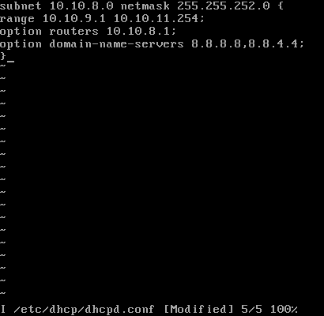
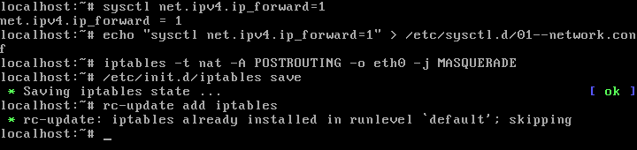
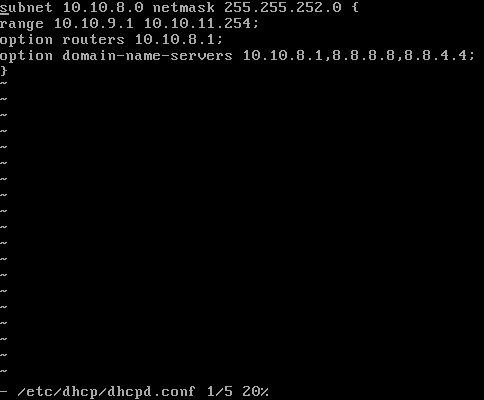
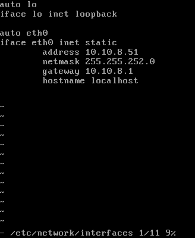
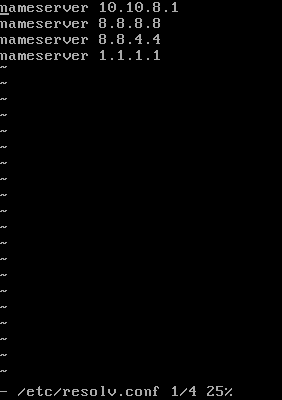
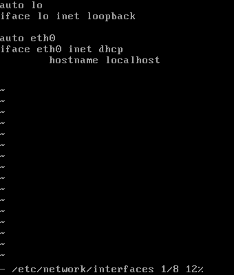
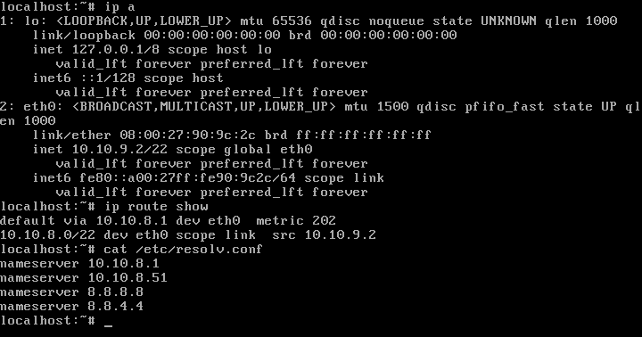
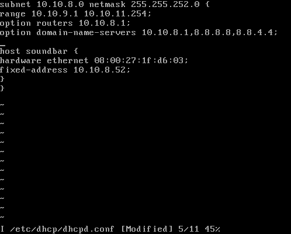

NET: 10.10.8.0/22
NETMASK: 255.255.252.0
HOST_MIN: 10.10.8.1
HOST_MAX: 10.10.11.254
BROADCAST: 10.10.11.255
GATEWAY: 10.10.8.1
HOST_COUNT: 1022 + 2

# PC-ROUTER-NAT:
## PODSTAWOWA KONFIGURACJA PC-ROUTER-NAT

Wrzucamy 2 karty sieciowe.
Karta eth0 podłączona do sieci NAT oraz kartę eth1 podłączoną do sieci SIECNAT-lan1.
Konfigurujemy dwa interfejsy sieciowe w pliku ``/etc/network/interfaces``. eth0-dynamicznie, eth1-statycznie z adresem ``10.10.8.1`` z początku naszej sieci zgodnie z konwencją oraz maską ``255.255.252.0``. 
Komendą ``rc-service networking restart`` restartujemy ustawienia naszych kart sieciowych.

Od tej chwili nasze karty sieciowe na PC-ROUTER-NAT są skonfigurowane. Możemy to podejrzeć komendą ``ip a``.

## DHCP-PC-ROUTER-NAT
W kolejnym kroku na naszym PC-ROUTER-NAT instalujemy usługę DHCP oraz dodajemy go do autostartu naszej maszyny. Unikniemy w ten sposób konieczności ręcznego uruchamiania usługi DHCP po restarcie lub awarii – ``apk add dhcp``, ``rc-update add dhcpd``.

Kolejnym krokiem jest skonfigurowanie usługi DHCP w katalogu ``/etc/dhcp/dhcpd.conf``.
Ustawiamy kolejno sieć ``subnet 10.10.8.0``, maskę ``netmask 255.255.252.0``, range ``range 10.10.9.1 10.10.11.254;``, option router ``option routers 10.10.8.1`` oraz option domain-servers ``option domain-servers 8.8.8.8,8.8.4.4``.  
Range mówi nam w jakim zakresie nasza maszyna ma przydzielać adresy IP, option-routers to nic innego jak nasza brama, czyli adres IP routera, przez którą inne urządzenia będą się łączyć z siecią rozległą (będą miały dostęp do internetu). Option domain-same-server (DNS) – na razie wrzuciliśmy googlowskie 8.8.8.8 oraz 8.8.4.4.

Zapisujemy ustawienia i restartujemy usługę ``rc-service dhcpd restart``.  
Od tego momentu nasz PC-ROUTER-NAT, każdemu nowemu urządzeniu będzie przydzielał adresy IP z zakresu 10.10.9.1-10.10.11.254, gateway-em 10.10.8.1 oraz DNS’ami 8.8.8.8 oraz 8.8.4.4 w seici 10.10.8.0/22.

## NAT-PC-ROUTER-NAT
W piewszym kroku uruchamiamy przekazywanie pakietów. Możemy to zrobić komendą ``sysctl net.ipv4.ip_forward=1``. Następnie dodajemy odpowiedni wpis, aby po restarcie lub awarii naszego PC-ROUTER-NAT zachowały się wszystkie nasze konfiguracje.  Zrobimy to poleceniem ``echo „sysctl net.ipv4.ip_forward=1” > /etc/sysctl.d/01—network.conf``.  
Od tego momentu przekierowanie pakietów włączy się automatycznie.

W kolejnym kroku uruchomimy translację adresów – NAT, czyli ukrywanie prywatnego adresu IP. Zmiana prywatnego na publiczny, którym się posługujemy w sieci. Jest nam to potrzebne, aby urządzenia które zostaną skonfigurowane w zadany sposób mogły się połączyć z internetem.

Aby to zrobić, trzeba dodać wpis do tablicy NAT-u.  
Potrzebny nam jest do tego program ``iptables``. Instalujemy go na naszej maszynie komendą ``apk add iptables``.  
IPTABLES w swoich „funkcjach” ma obsługę NAT'u.  
W naszej maszynie wpisujemy ``iptables –t nat –A POSTROUTING –o eth0 –j MASQUERADE``.  
Oznacza to iptables (*wywołujemy program iptables*) –t (*target/cel jakiej tablicy dotyczy modyfikacja*) nat –A (*append/dodaj wpis do POSTROUTING – czyli modyfikacja pakietu po odebraniu*) –output (*wszystko co wychodzi na ... będą poddane operacji*) eth0 –j MASQUERADE (*maskowanie adresu prywatnego pod adres publiczny*).  
Ostatnim krokiem jest zapisanie tego wpisu na stałe programie iptables oraz dodanie programu do autostartu systemu. Zrobimy to komendą ``/etc/init.d/iptables save`` oraz  ``rc-update add iptables``.

Od tego momentu po starcie naszego PC-ROUTER-NAT wczyta się automatycznie program iptables z dokonanym wpisem o translacji prywatnych adresów IP na publiczne adresy IP.

## DNS-PC-ROUTER-NAT
Ostatnią rzeczą, która nam została do skonfigurowania na naszym PC-ROUTER-NAT jest DNS.
W pierwszym kroku instalujemy program DNSMASQ – ``apk add dnsmasq`` oraz wrzucamy do autostartu ``rc-update add dnsmasq``.

W kolejnym kroku edytujemy plik hosts w katalogu ``/etc/hosts``. Chcemy, aby kluczowe zasoby: 
* Erp.mojaorganizacja.pl rozwiązał się na adresie 10.10.8.51
* Drukarka.mojaorganizacja.pl na 10.10.8.50
* Router.mojaorganizacja.pl na 10.10.8.1
Jak już wiemy, adres 10.10.8.1 jest to adres naszego routera. Pozostałe dwa adresy to adresy, które zostały przypisane statycznie do serwera 10.10.8.51 i drukarki 10.10.8.50 w naszej firmie. 

Wróćmy teraz do naszych DNS'ów. Edytujemy więc nasz plik dhcpd.conf w katalogu ``/etc/dhcp/dhcpd.conf`` i dokonujemy odpowieniego wpisu w ``option domain-name-server 10.10.8.1``. Po takiej niewielkiej zmianie komunikacja z tymi zasobami zawsze rozwiąże się na ustalonym adresie IP z pliku hosts, gdzie w pierwszej kolejności zagląda system po próbie komunikacji. 

# POZOSTAŁE URZĄDZENIA (serwer/drukarka-static, inne urządzenia-dhcp)
* Teraz pora na konfigurację naszych urządzeń w biurze. Serwer oraz drukarka mają posiadać stałe IP celem zminimalizowania potrzeby rekonfiguracji ustawień klientów. Tak więc na serwerze i drukarce edytujemy interface karty sieciowej eth0 na statyczny z odpowiednim adresem, który ustaliliśmy wcześniej ``SERWER-10.10.8.51``, ``DRUKARKA 10.10.8.50``. Ustawiamy bramę na ``10.10.8.1``, czyli nasz PC-ROUTER-NAT, co nam pozwoli na połączenie z siecią. Edytujemy również plik z DNS'ami ``/etc/resolv.conf`` i wpisujemy ręcznie ``nameserver 10.10.8.1``

 
Tak samo robimy na drukarce: 

 
Możemy przejrzeć ustawienia komendą ``ip a``, ``ip route show`` oraz podejrzeć DNS-y ``cat /etc/resolv.conf``. 

 
Pozostałe urządzenia mają dynamiczną konfigurację tak jak ustaliliśmy na routerze z zakresu 10.10.9.1-10.10.11.254. Wystarczy na tych urządzeniach ustawić interface sieciowy na DHCP.

Każde nowe urządzenie w firmie po protokole DHCP uzyska pełną konfigurację sieci zgodnie z naszą wolą. Możemy przejrzeć ustawienia komendą ``ip a``, ``ip route show`` oraz podejrzeć DNS'y ``cat /etc/resolv.conf`` 

* Drugą metodą jest ustawienie statycznego IP na urządzeniach poprzez usługę DHCP. Na PC-ROUTER-NAT w pliku ``/etc/dhcp/dhcpd.conf`` dodajemy odpowiedni wpis wraz z adresem MAC urządzenia do którego chcemy przypisać stałe IP. Pozwoli nam to na przesłanie temu urządzeniu pełnej konfiguracji ustawień. Nie będzie już konieczna modyfikacja ręczna jak to miało miejsce w powyższym przykładzie.

``Host soundbar {  
Hardware ethernet *adres MAC urządzenia*;  
Fixed-address *adres ip który chcemy przypisać statycznie*;  
}``  
W tym przypadku dodałem statyczny adres IP 10.10.8.52 urządzeniu o adresie MAC 08:00:27:1f:d6:03 

Teraz wystarczy na tym urządzeniu w pliku ``/etc/network/interfaces`` dodać odpowiedni wpis, aby poprosiło o przydzielenie adresu IP po DHCP, tak jak to robiliśmy poprzednio.

``Auto eth0  
Iface eth0 inet dhcp  
Hostname localhost``
